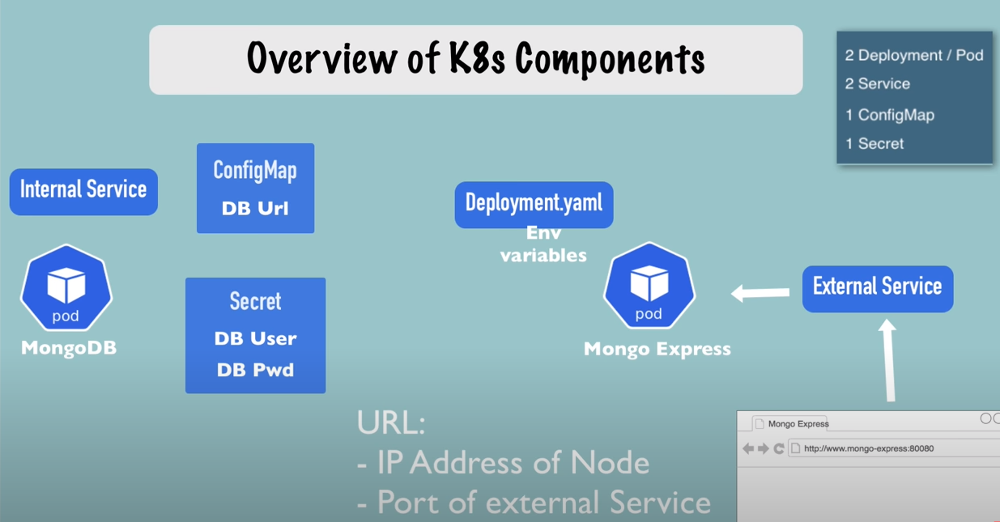

mongodb-based app's kubernetes deployment
================

What's this?
------

Simple k8s configuration for deployment of [mongodb](https://hub.docker.com/_/mongo) database 
with [mongo-express-based](https://hub.docker.com/_/mongo-express) UI.

Kubernetes deployment architecture
------



It's implemented based on 

Getting started
------

```
## initialize kubernetes env for the app (create namespace, generate secrets etc.)
## WARNING!!! it uses the k8s/secret.yaml file which is commited to the repo
for demo purposes only. In real-world apps the secrets should NOT be stored in
the repo.

make init

## deploy the k8s stack to the default cluster
make deploy

```
